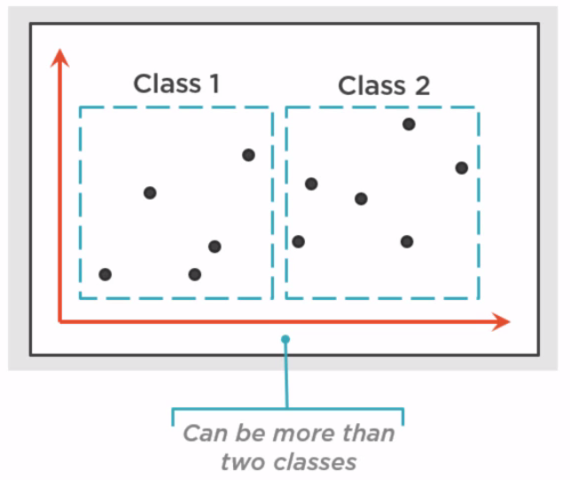

<!-- START doctoc generated TOC please keep comment here to allow auto update -->
<!-- DON'T EDIT THIS SECTION, INSTEAD RE-RUN doctoc TO UPDATE -->
**Table of Contents**  *generated with [DocToc](https://github.com/thlorenz/doctoc)*

- [Machine Learning Intro](#machine-learning-intro)
  - [What is ML?](#what-is-ml)
    - [Finding Patterns](#finding-patterns)
    - [Learning](#learning)
    - [ML in a Nutshell](#ml-in-a-nutshell)
    - [Why is ML so popular?](#why-is-ml-so-popular)
      - [Who's Interested in ML?](#whos-interested-in-ml)
      - [What is a data scientist?](#what-is-a-data-scientist)
      - [ML Offerings](#ml-offerings)
    - [The Role of R](#the-role-of-r)
  - [The ML Process](#the-ml-process)
    - [Asking the Right Question](#asking-the-right-question)
    - [Illustrating the ML Process](#illustrating-the-ml-process)
    - [Example Machine Learning Scenarios](#example-machine-learning-scenarios)
  - [A Closer Look at the ML Process](#a-closer-look-at-the-ml-process)
    - [Terminology](#terminology)
    - [Data Pre-processing](#data-pre-processing)
    - [Categorizing Machine Learning Problems](#categorizing-machine-learning-problems)
    - [Styles of Machine Learning Algorithms](#styles-of-machine-learning-algorithms)
    - [Training and Testing a Model](#training-and-testing-a-model)
    - [Using a Model](#using-a-model)

<!-- END doctoc generated TOC please keep comment here to allow auto update -->

# Machine Learning Intro

> Intro to Machine Learning with Pluralsight.

A gentle introduction and some definitions (non technical).

## What is ML?

### Finding Patterns

ML finds patterns in data. Uses those patterns to predict the future. Examples:
- Detect credit card fraud by finding patterns in data to detect when new transaction is likely to be fraudulent.
- Determine if a customer is likely to switch to a competitor.
- Decide when to do preventive maintenance on a factory robot.

### Learning

Requires:
- Identifying patterns.
- REcognize patterns when seen again

ML does this with provided data. Suppose data on cc transactions looks like:

| Name        | Amount           | Fraudulent  |
| ------------- |:-------------:| -----|
| Smith     | $2,600.45 | No |
| Potter     | 2$,294.58      |   Yes |
| Peters | $1,003.30      |    Yes |
| Adams | $8,488.32      |    No |

This data suggests if name starts with `P`, it's fraudulent. Having so little data demonstrates that it's difficult to find patterns that are *predictive*, i.e. to help understand if a new transaction is likely to be fraudulent.

Now consider more data records and more fields:

Now a pattern emerges - transaction is fraudulent if card holder is in their 20's, card issued in USA, used in Russia, amount > $1,000. But even so can't guarantee this is predictive. To do a good job, need so much data that it's too much for a human to process.

### ML in a Nutshell

- Start with data that contains patterns.
- Feed data into *Machine learning algorithm* that finds patterns in the data.
- Algorithm generates *Model* - functionality (typically code) that is able to recognize patterns when presented with new data.
- Applications use Model, supplying new data to see if it matches known patterns (eg: new cc transactions).
- Model returns probability if given new data matches pattern (eg: if new cc transaction is fraudulent).

### Why is ML so popular?

Doing ML well requires:
- Lots of data, which is increasingly more available in *Big Data* era.
- Lots of compute power, also increasingly available in *Cloud* era.
- Effective ML agorithms, also more available as a result of years of research.

#### Who's Interested in ML?

- Business leaders: Want solutions to business problems (eg: fraudulent transactions, customers switching to competitors). These people also have the $$ to pay for ML solutions.
- Software developers: Want to build better/smarter applications. These applications can rely on models created via ML to make better predictions. Apps can be smarter even if developer writing them did not create the ML model.
- Data scientists: Want powerful, easy-to-use tools.

#### What is a data scientist?

Role combines:

- Statistics
- ML software
- Knowledge in a specific problem domain, eg: cc transaction fraud, robot preventive maintenance, etc.

#### ML Offerings

ML also referred to as *Predictive Analytics*.

### The Role of R

Open source programming language *and* environment. Supports ML, statistical computing and more. Has many packages. Very popular.

Python also increasingly popular.

## The ML Process

### Asking the Right Question

Most important part of the process.

**Is the right data to answer the question available?**

For example, maybe in determine cc fraud, the most predictive piece of information is whether card holder is a home owner or renter. Or how long they've lived at current address. In this case, you would need this data to answer the question "Is a cc transaction fraudulent?".

**Do you know how you'll measure success?**

How good must the model predictions be to make the process quality as success. Eg: if cc fraud model predicts accurately in 8 of 10 cases, is that good enough? 6 of 10? Do you need 9 of 10? Determine success criteria up front so you know when you're done.

### Illustrating the ML Process

- Choose raw data, work with domain experts. Raw data is not in right form, may have dupes, extra info not needed etc.
- Apply pre-processing to raw data to get *Prepared Data*, which becomes input to ML. May have to iterate on pre-processing to get good useful data. Majority of time will be spent in this phase.
- Apply ML algorithms to data.
- Result is *Candidate Model*. Iterate applying algorithms to data to get increasingly better models, until a model that is good enough to deploy emerges.
- Deploy chosen model.
- Applications can make use of deployed model.

**Repeating the ML Process**

Entire process must be repeated, model must be recreated regularly, to keep model up to date with changing reality. For example processing new data or algorithms.

### Example Machine Learning Scenarios

**Scenario: Detecting Credit Card Fraud**

- Given cc customers supplying their payment info to payment application (eg: POS terminal at grocery store). Which should app reject because they're likely fraudulent?
- Start with historical transaction data, run through ML process to get model that app can call to make decision.

**Scenario: Predicting Customer Churn**

- Eg: mobile phone company with customers who call in to call center.
- Call center staff use Call Center App.
- For each caller, want staff to know, how likely is that customer to switch to a competitor.
- Staff can offer customers who are about to switch a better deal than a loyal customer.
- Mobile phone company may have large volume of detailed call data on their customers. They could use an app to aggregate it (eg: Hadoop, Spark), then combine this data with other data such as CRM system. Then the resulting data combined from multiple sources can be fed into the ML process to produce a model, that call center app can thenuse to predict likelihood of customer leaving.

ML commonly used together with other data technologies.

**Scenario: Predicting Equipment Failure**

- Devices (eg: thermostats,robots in a factory etc) that generate streaming data handled by real-time data processing software.
- Software looking for anomalies/patterns that predict failure.
- When potential failure found, software contacts notifier app that notifies business users to take action.
- How doe sreal-time data processing software know what to look for? Could have historical database devices have produced already.
- Historical data used as input to ML to create model that real-time processing can use.

## A Closer Look at the ML Process

### Terminology

**Training Data:**
Prepared data used to create a model. Because creating a model is called training a model.

Two categories of ML:

**1. Supervised Learning:**
Value you want to predict is in the training data. eg: predicting cc fraud - whether or not a given transaction was fraudulent is already a populated field in each record in the training data. The data is *labeled*.

**2. Unsupervised Learning**
Value you want to predict is NOT in the training data. The data is *unlabeled*.

Supervised learning is the more common approach.

### Data Pre-processing

ML starts with data. Could be from a relational, nosql, binary etc. This is *raw data*.
Raw data needs to be read into *Data Preprocessing Module(s)* (typically chosen ML technology provides this).
Preprocessing required because raw data is rarely in the right shape to be procesed by ML algorithms.

Raw data could have missing values, be redundant, have dupes, might contain some info that is not predictive (i.e. won't help to create a good model).

Output of preprocessing step is *Training Data*. Training data typically has columns, these are called *Features*.
Eg: in cc fraud scenario, data contained fields such as country of issue, country of use, these are all features.

In supervised learning, the value you want to predict is in the training data, (eg: cc fraud - whether transaction was fraudulent). This is called the *Target Value*.

### Categorizing Machine Learning Problems

3 of the most used:

**Regression**

Problem: Have data, would like to find a line/curve that best fits the data. Regression problems are typically supervised learning scenarios. For example, given some historical sales data, business would ask "How many units of thisproduct will we sell next month?"

**Classification**

Problem: Have data, want to group it into at least two or more *classes*. When new data comes in, want to determine which class that data belongs to. Commonly used with supervised learning. Eg: Is this cc transaction fraudulent? i.e. does a new transaction belong in the "fraudulent" or "not fraudulent" class? Response will not be yes/no, but a probability of which class new transaction might be in.

**Clustering**

Problem: Have data, want to find clusters within the data. Used with unsupervised learning. Data is not labelled, don't know exactly what you're looking for. Eg: What are our customer segments?

### Styles of Machine Learning Algorithms

- Decision tree
- Neural network (somewhat how brain works)
- Bayesian (use Bayes theorem to calculate probabilities)
- K-means (for clustering)
- more...

### Training and Testing a Model

**Training**

- Start with training data (supervised learning).
- Choose *features* that are most predictive of the *target value*.
- Input training data into chosen learning algorithm, but only send in 75% of data, not the whole thing.
- Training data could have lots of features, even hundreds - how to choose which features are predictive and how many should be used? Data scientists are concerned with these difficult problems.
- Generate candidate model
- Determine if model is any good - testing...

**Testing**

- Input test data (remaining 25% that was held back in training) into candidate model.
- Candidate model generates target values from test data.
- You know what the target values *should* be because they're in the training data.
- Compare target values produced by candidate model from test data to the real target values in the training data.

**Improving Model**

Suppose testing reveals candidate model not very predictive. Can be improved by:

- Choose different features.
- Get new or more data.
- Modify parameters in algorithm or choose a different algorithm
- Iterate - aka trial and error

Note even though process is called "Machine Learning", there are many human decisions involved such as what features to use, algorithms, parameters etc.

### Using a Model

Application can call model providing values for features required by model.
